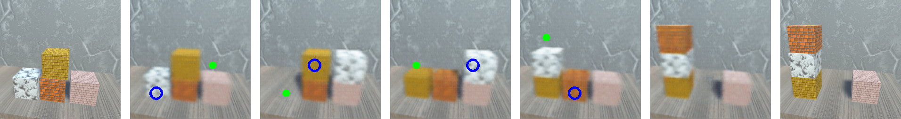
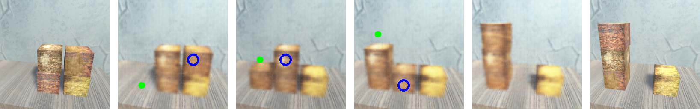
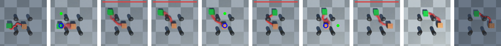

# Latent Space Roadmap V2
This is the code for the paper: Enabling Visual Action Planning for Object Manipulation through Latent Space Roadmap.

Visit the dedicated website for more information: https://visual-action-planning.github.io/lsr-v2/

If you use this code in your work, please cite it as follows:

## Bibtex

```
@article{lippi2022enabling,
  title={Enabling visual action planning for object manipulation through latent space roadmap},
  author={Lippi, Martina and Poklukar, Petra and Welle, Michael C and Varava, Anastasia and Yin, Hang and Marino, Alessandro and Kragic, Danica},
  journal={IEEE Transactions on Robotics},
  volume={39},
  number={1},
  pages={57--75},
  year={2022},
  publisher={IEEE}
}
```

## Simulation example

### setup

```
pip install -r requirements.txt
```

### Datasets
download datasets:
```
cd datasets
python get_datasets.py
cd ..
```

To make train and test splits for all tasks run:
```
python lsrv2_preprocess_datasets.py
```


### Train Mapping Modules (MM)

To train the MM for box stacking normal taks use:
```
python train_MM.py --exp_vae="box_stacking_normal_task_MM" 
```

To train the MM for box stacking hard taks use:
```
python train_MM.py --exp_vae="box_stacking_hard_task_MM"
```

To train the MM for rope-box taks use:
```
python train_MM.py --exp_vae="rope_box_task_MM" 
```


### Train Action Proposal Modules (APM)

To make action splits for all tasks run:
```
python lsrv2_preprocess_datasets_APM.py
```

To train the APN for box stacking normal taks use:
```
python train_APM.py --exp_apn="box_stacking_normal_task_APM" 
```

To train the APN for box stacking hard taks use:
```
python train_APM.py --exp_apn="box_stacking_hard_task_APM" 
```

To train the APN for rope-box taks use:
```
python train_APM.py --exp_apn="rope_box_task_APM" 
```


### Execute simulation LSR-V2 example


For box stacking normal taks use:
```
python lsrv2_simulation_examples.py --example="rigid_normal"
```

For box stacking hard taks use:
```
python lsrv2_simulation_examples.py --example="rigid_hard"
```

For hybrid rope-box taks use:
```
python lsrv2_simulation_examples.py --example="hybrid"
```

You should get a image like this in the root folder as a result: (depending on your random seed)


 

 

 


